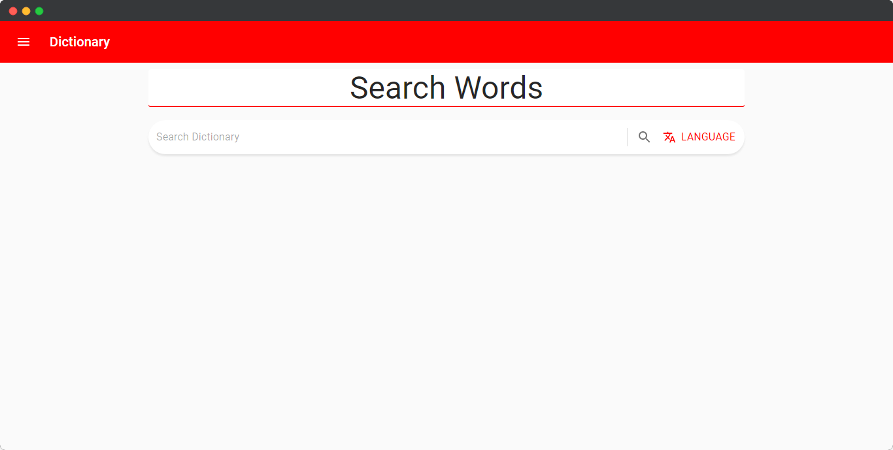
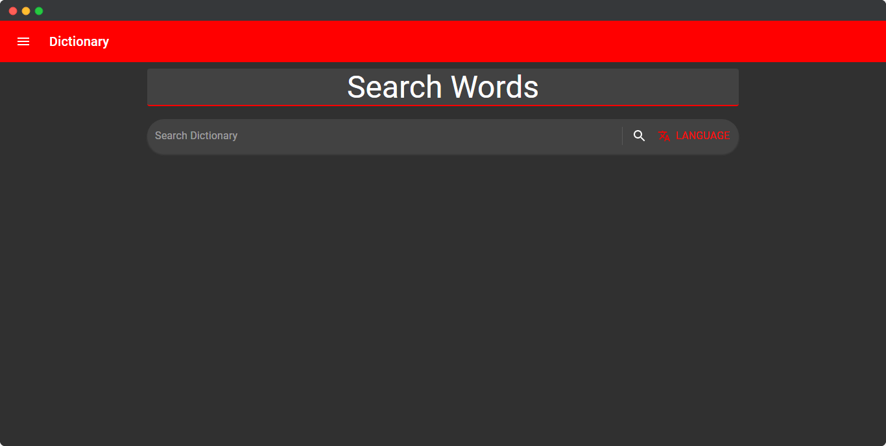
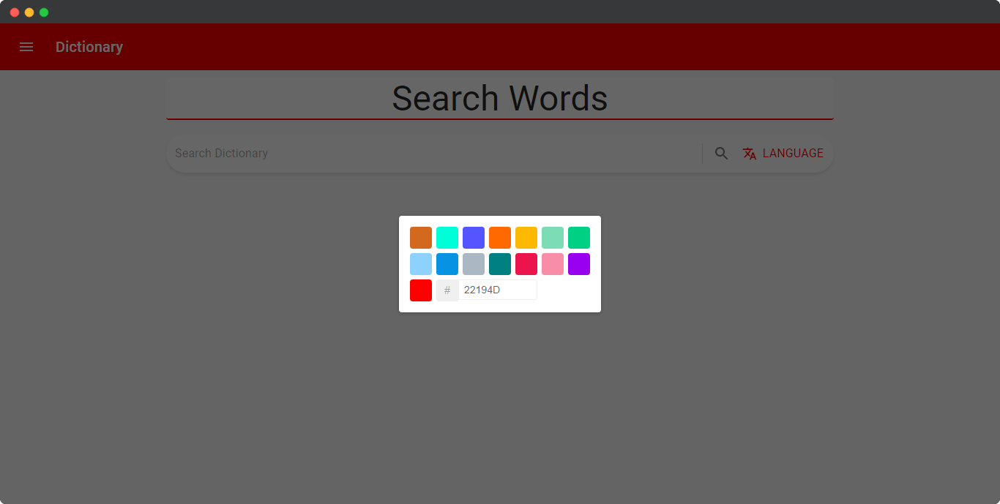
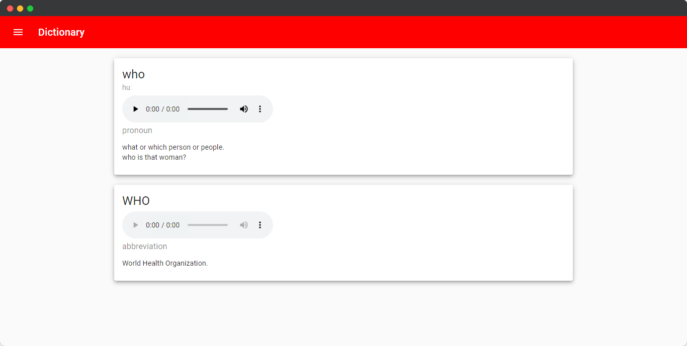
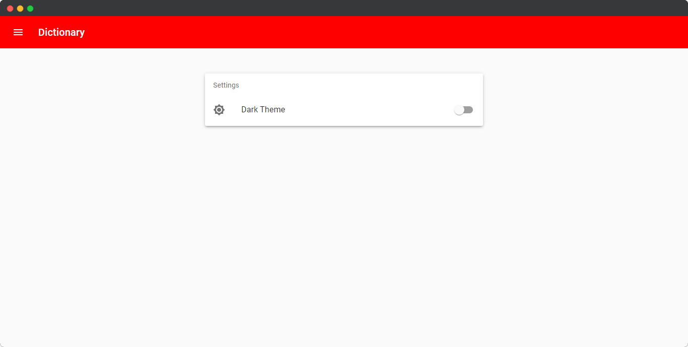
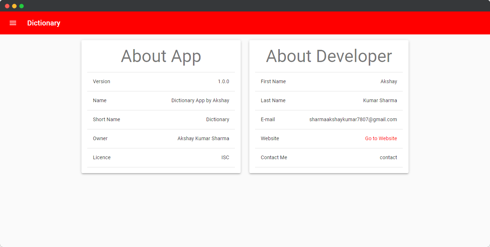

# Dictionary50
#### Video Demo:  https://youtu.be/mcA5Ett3PdA
#### Description:

Hello! This is a dictionary app made with react and material-ui.
You can search words in this app and get their meanings, pronounciation and full-forms.

It has a simple user interface inspired by material-ui.

With dark theme included and custom theaming features you can customize the whole app.

The app uses local storage to store user preferences. Which gives the app capabilities to remember user settings even after the page reload or you close the browser and revisit the site again.
It will remember your preferred theme type and theme color.

By default the theme is light and the theme color is red but you can change as you want. you can change the theme to be dark and the theme color to be any color you want by giving hex code of that color or select from some predefined colors.
You can search any word in English. It will give you some definations, pronounciations, full-forms and part of speeches.

It also provides you some phonetics that you can use to easily pronounce words.
Some examples are also given.

Several technologies are used in this app:
- React
- Material-UI
- React-Router
- Javascript
- HTML
- CSS

Some libraries are also used in this project:
- Axios
- React-color
- react-virtualized-auto-sizer
- etc.

This web app is a Progressive Web App (PWA). It means it can be installed in your device as an application. It can also work offline but to search words you must have internet connection and everything else will work even when you are offline.

For PWA features I have used Workbox.js which is a set of libraries that can power a production-ready service worker for a Progressive Web App.

The site is deployed on Netlify. With the help of netlify-cli.
live demo: https://aks-dictionary.netlify.app/

And My name is Akshay Kumar Sharma. My age is 15 years. I live in Jaipur, Rajasthan, India. And This is 

Dictionary50

Email: shramaakshaykumar7807@gmail.com

Website: https://akshayprogrammer7807.wordpress.com/

Github: https://github.com/Akshay-Kumar-Sharma7807

##### Getting Started

First of all install all the dependencies.
`npm install`

and then run the server
`npm start`

Voila! the app should be running on port 3000 on your machine.

## Available Scripts

In the project directory, you can run:

### `npm start`

Runs the app in the development mode.\
Open [http://localhost:3000](http://localhost:3000) to view it in the browser.

The page will reload if you make edits.\
You will also see any lint errors in the console.

### `npm test`

Launches the test runner in the interactive watch mode.\
See the section about [running tests](https://facebook.github.io/create-react-app/docs/running-tests) for more information.

### `npm run build`

Builds the app for production to the `build` folder.\
It correctly bundles React in production mode and optimizes the build for the best performance.

The build is minified and the filenames include the hashes.\
Your app is ready to be deployed!

See the section about [deployment](https://facebook.github.io/create-react-app/docs/deployment) for more information.